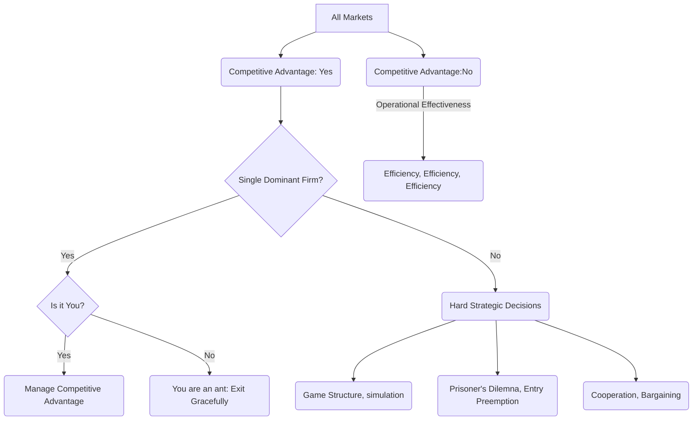

The starting point for a strategic analysis is to do a market-by-market  assessment of the existence and sources of competitive advantage (see [[Strategic Decisions Vs Tactical Decisions]]), and then to assess the size of the respective players. 

This leads to the following decision tree:

See Also [[Prisoners Dilemna]]